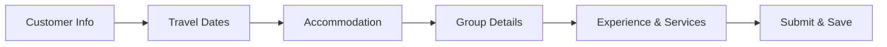

# 🌍 International Customer Inquiry System

<div align="center">


_An elegant, multi-step travel inquiry form that transforms customer travel planning into a delightful experience_

[🚀 Live Demo](#-getting-started) • [📖 Documentation](#-features) • [🛠️ Installation](#-installation) • [🤝 Contributing](#-contributing)

</div>

---

## ✨ Overview

The **International Customer Inquiry System** is a sophisticated, user-friendly web application designed to streamline the travel booking process. Built with modern web technologies, it provides travel agencies and customers with an intuitive platform to capture detailed travel requirements, preferences, and special arrangements.

### 🎯 Purpose

This system bridges the gap between travel agencies and international customers by providing:

- **Structured Data Collection**: Comprehensive travel information gathering
- **Enhanced User Experience**: Step-by-step guided form completion
- **Real-time Validation**: Instant feedback on form entries
- **Flexible Accommodations**: Support for complex room configurations
- **Special Events**: Built-in support for celebrations and special occasions

---

## 🌟 Features

### 🎨 **Modern User Interface**

- **Multi-step Form Design**: Intuitive step-by-step navigation
- **Responsive Layout**: Perfect experience across all devices
- **Smooth Animations**: Framer Motion powered transitions
- **Dynamic Validation**: Real-time field validation with visual feedback
- **Progress Indicators**: Clear visual progress through form sections

### 🏨 **Comprehensive Travel Planning**

- **Customer Information**: Full contact and nationality details
- **Flight Details**: Optional arrival/departure flight information
- **Date Management**: Intelligent date selection with night calculation
- **Accommodation Options**: Flexible hotel categories and room configurations
- **Group Management**: Support for travelers of all ages
- **Experience Customization**: Tour types, transport, and activity preferences
- **Special Arrangements**: Built-in support for celebrations and events

### 🔧 **Advanced Functionality**

- **Dynamic Room Selection**: Multi-room booking with duplicate prevention
- **Conditional Fields**: Smart form fields that appear based on selections
- **Custom Services**: Allow customers to add custom service requests
- **Data Persistence**: Reliable data storage with Supabase backend
- **Form Reset**: Complete form clearing functionality
- **Error Handling**: Comprehensive error management and user feedback

### 📱 **Technical Excellence**

- **TypeScript**: Full type safety and developer experience
- **Modern React**: Latest React 19 features and hooks
- **Server Components**: Next.js 15 optimizations
- **Tailwind CSS**: Utility-first styling approach
- **Component Library**: Radix UI for accessibility and consistency

---

## 🛠️ Tech Stack

<table>
<tr>
<td align="center"><strong>Frontend</strong></td>
<td align="center"><strong>Backend</strong></td>
<td align="center"><strong>Styling</strong></td>
<td align="center"><strong>Tools</strong></td>
</tr>
<tr>
<td align="center">
<br/>
<br/>

</td>
<td align="center">
<br/>

</td>
<td align="center">
<br/>
<br/>

</td>
<td align="center">
<br/>
<br/>

</td>
</tr>
</table>

---

## 🚀 Getting Started

### 📋 Prerequisites

Before you begin, ensure you have the following installed:

```bash
Node.js >= 18.17.0
pnpm >= 8.0.0 (recommended) or npm >= 9.0.0
Git
```

### 💻 Installation

1. **Clone the repository**

```bash
git clone https://github.com/dinethsadee01/International-Customer-Inquiry.git
cd International-Customer-Inquiry
```

2. **Install dependencies**

```bash
pnpm install
# or
npm install
```

3. **Set up environment variables**

```bash
cp .env.local.example .env.local
```

Edit `.env.local` with your Supabase credentials:

```env
NEXT_PUBLIC_SUPABASE_URL=your_supabase_project_url
NEXT_PUBLIC_SUPABASE_ANON_KEY=your_supabase_anon_key
```

4. **Set up the database**

Create a table in your Supabase project:

```sql
CREATE TABLE client_inquiry (
    id BIGSERIAL PRIMARY KEY,
    created_at TIMESTAMP WITH TIME ZONE DEFAULT NOW(),

    -- Customer Information
    full_name TEXT NOT NULL,
    email_address TEXT NOT NULL,
    contact_number TEXT NOT NULL,
    nationality TEXT NOT NULL,
    country TEXT NOT NULL,

    -- Flight Information (Optional)
    arrival_flight TEXT,
    departure_flight TEXT,

    -- Travel Dates
    arrival_date TIMESTAMP WITH TIME ZONE NOT NULL,
    departure_date TIMESTAMP WITH TIME ZONE NOT NULL,
    no_of_nights INTEGER NOT NULL,

    -- Accommodation
    hotel_category TEXT NOT NULL,
    room_type JSONB NOT NULL,
    basis TEXT NOT NULL,

    -- Group Details
    no_of_pax INTEGER NOT NULL,
    children TEXT NOT NULL,

    -- Experience & Services
    tour_type TEXT NOT NULL,
    transport TEXT NOT NULL,
    site_interests JSONB,
    other_service JSONB NOT NULL,

    -- Special Arrangements
    special_arrangements TEXT NOT NULL,
    special_arrangements_date TIMESTAMP WITH TIME ZONE
);
```

5. **Run the development server**

```bash
pnpm dev
# or
npm run dev
```

6. **Open your browser**
   Navigate to [http://localhost:3000](http://localhost:3000) to see the application.

---

## 📖 Usage

### 🎯 **Form Sections**

1. **Customer Information**
   - Basic contact details and nationality
   - Optional flight information
2. **Travel Dates**
   - Arrival and departure date selection
   - Automatic night calculation
3. **Accommodation**
   - Hotel category selection
   - Dynamic room configuration
   - Meal plan preferences
4. **Group Details**
   - Number of travelers
   - Children age categories
5. **Experience & Services**
   - Tour type preferences
   - Transportation options
   - Interest areas and activities
   - Additional services
   - Special arrangements for celebrations

### 🔄 **Form Flow**



### ✅ **Validation Rules**

- **Required Fields**: Clearly marked and validated
- **Email Format**: Standard email validation
- **Date Logic**: Departure must be after arrival
- **Room Configuration**: No duplicate room combinations
- **Special Dates**: Required when special arrangements selected

---

## 🏗️ Project Structure

```
├── app/
│   ├── globals.css          # Global styles
│   ├── layout.tsx           # Root layout component
│   └── page.tsx             # Main form component
├── components/
│   ├── theme-provider.tsx   # Theme management
│   └── ui/                  # Reusable UI components
│       ├── button.tsx
│       ├── card.tsx
│       ├── input.tsx
│       ├── select.tsx
│       └── ...
├── lib/
│   ├── supabase.ts          # Supabase client configuration
│   └── utils.ts             # Utility functions
├── public/                  # Static assets
├── styles/                  # Additional styles
└── types/                   # TypeScript type definitions
```

---

## 🎨 Customization

### 🎭 **Theming**

The application uses Tailwind CSS with a custom design system:

```css
/* Custom color palette */
:root {
  --primary: 220 14% 96%;
  --primary-foreground: 220 9% 46%;
  /* ... */
}
```

### 🧩 **Adding New Fields**

1. **Update the form configuration**:

```typescript
const fieldConfig = {
  "New Field": {
    type: "text",
    icon: <Icon size={18} />,
    placeholder: "Enter value",
  },
};
```

2. **Add to section definition**:

```typescript
{
  title: "Section Name",
  fields: ["New Field"],
  required: ["New Field"], // if required
}
```

3. **Update database schema** to include the new field.

---

## 🤝 Contributing

We welcome contributions! Please follow these steps:

1. **Fork the repository**
2. **Create a feature branch**: `git checkout -b feature/amazing-feature`
3. **Make your changes** and ensure they follow our coding standards
4. **Add tests** for new functionality
5. **Commit your changes**: `git commit -m 'Add amazing feature'`
6. **Push to the branch**: `git push origin feature/amazing-feature`
7. **Open a Pull Request**

### 📏 **Code Standards**

- Use TypeScript for all new code
- Follow the existing component patterns
- Ensure responsive design
- Add proper error handling
- Include JSDoc comments for complex functions

---

## 📝 License

This project is licensed under the MIT License - see the [LICENSE](LICENSE) file for details.

---

## 🙏 Acknowledgments

- **Radix UI** for accessible component primitives
- **Tailwind CSS** for the utility-first CSS framework
- **Supabase** for the backend-as-a-service platform
- **Framer Motion** for smooth animations
- **Lucide React** for beautiful icons
- **Next.js** team for the incredible framework

---

## 📞 Support

If you have any questions or need support:

- 📧 **Email**: [your-email@example.com](mailto:your-email@example.com)
- 🐛 **Issues**: [GitHub Issues](https://github.com/dinethsadee01/International-Customer-Inquiry/issues)
- 💬 **Discussions**: [GitHub Discussions](https://github.com/dinethsadee01/International-Customer-Inquiry/discussions)

---

<div align="center">

If this project helped you, consider buying me a coffee! Your support helps keep this project alive and growing.

<div align="center">

[](https://www.buymeacoffee.com/grandwarlock)

<!-- Buy Me a Coffee Button (HTML) -->

```
<script type="text/javascript" src="https://cdnjs.buymeacoffee.com/1.0.0/button.prod.min.js" data-name="bmc-button" data-slug="grandwarlock" data-color="#FFDD00" data-emoji="☕"  data-font="Lato" data-text="Buy me a coffee" data-outline-color="#000000" data-font-color="#000000" data-coffee-color="#ffffff" ></script>
```

Made with ❤️ by [Dineth Sadee](https://github.com/dinethsadee01)

</div>
